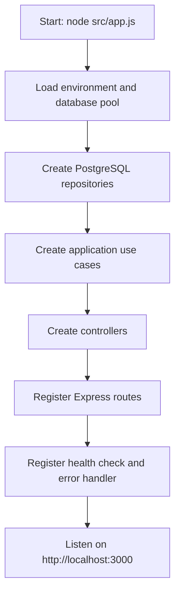
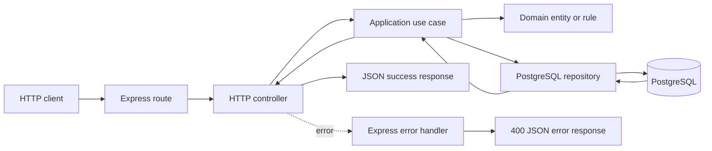
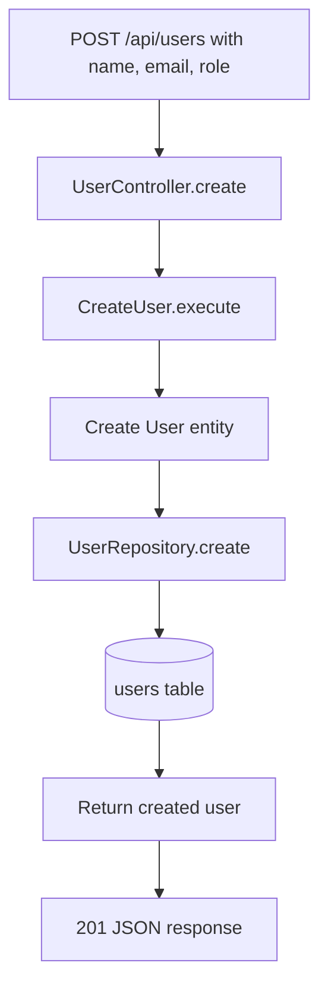
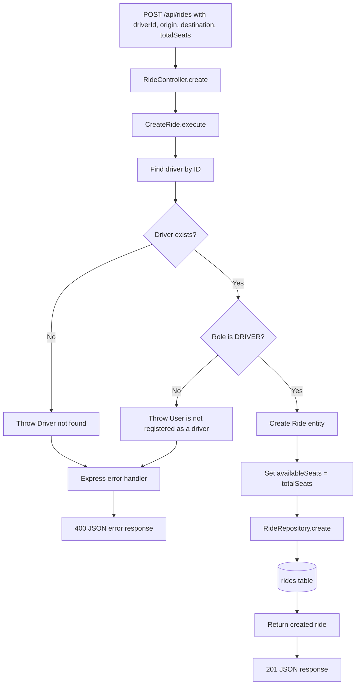
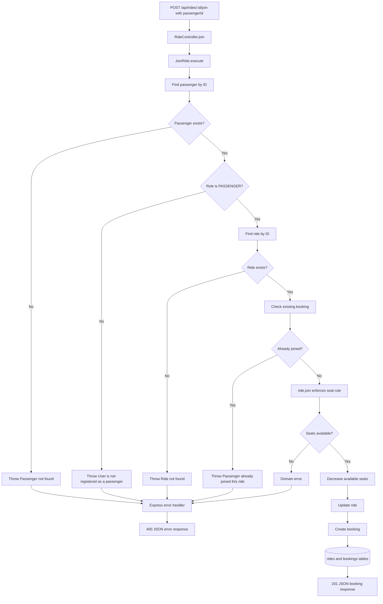
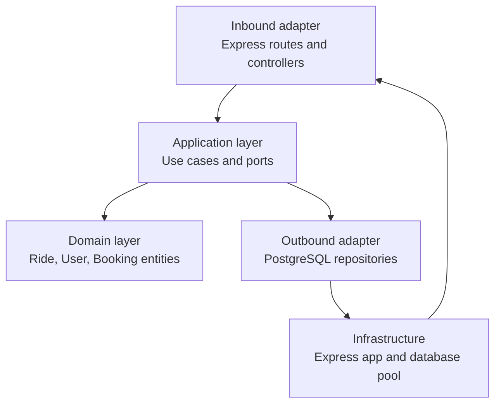

# Car Pool Project Flow

This document shows how a request travels through the Car Pool API.

## 1. Application Startup



`src/app.js` is the composition root. It connects the infrastructure, repositories, use cases, controllers, and routes through dependency injection.

## 2. Common HTTP Request Flow



Controllers translate HTTP input and output. Use cases contain application decisions. Repositories are the persistence boundary, and domain entities enforce core rules.

## 3. Available Routes

| Method | Endpoint               | Controller action         | Use case       |
| ------ | ---------------------- | ------------------------- | -------------- |
| `GET`  | `/`                    | Health check              | None           |
| `POST` | `/api/users`           | `UserController.create`   | `CreateUser`   |
| `GET`  | `/api/users/:id/rides` | `UserController.getRides` | `GetUserRides` |
| `POST` | `/api/rides`           | `RideController.create`   | `CreateRide`   |
| `GET`  | `/api/rides`           | `RideController.getAll`   | `GetRides`     |
| `GET`  | `/api/rides/:id`       | `RideController.getById`  | `GetRideById`  |
| `POST` | `/api/rides/:id/join`  | `RideController.join`     | `JoinRide`     |

## 4. Create User Flow



## 5. Create Ride Flow



## 6. Join Ride Flow



## 7. Read Flows

### List rides

`GET /api/rides` follows:

```text
Route -> RideController.getAll -> GetRides -> RideRepository.findAll -> PostgreSQL -> 200 JSON
```

### Get one ride

`GET /api/rides/:id` follows:

```text
Route -> RideController.getById -> GetRideById -> RideRepository.findById -> PostgreSQL -> 200 JSON
```

### Get a user's booked rides

`GET /api/users/:id/rides` follows:

```text
Route -> UserController.getRides -> GetUserRides -> BookingRepository.findByUserId -> PostgreSQL -> 200 JSON
```

## 8. Main Architectural Layers



The dependency direction keeps business logic independent from Express and PostgreSQL. The application layer receives repository implementations through constructors, which makes the boundaries explicit.
