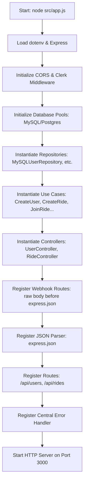

# 🚗 CarPool Backend — Complete Project Flow & Architecture

This document explains the **complete backend architecture, dependency injection lifecycle, and all API request workflows** implemented in the Express 5 Node.js backend.

---

## 🏛️ Architecture Overview (Hexagonal / Clean Architecture)

```text
┌─────────────────────────────────────────────────────────┐
│                     EXTERNAL SERVICES                   │
│  • Clerk (Authentication & User Management SDK)         │
│  • MySQL (Primary Relational Database)                  │
│  • PostgreSQL (Alternative Relational Database)         │
└─────────────────────────────────────────────────────────┘
                           ↕
┌─────────────────────────────────────────────────────────┐
│                   HEXAGONAL ARCHITECTURE                │
├─────────────────────────────────────────────────────────┤
│  Adapters (Inbound / Driving)                           │
│  ├── HTTP Controllers (UserController, RideController) │
│  ├── Validators (userValidator)                        │
│  ├── Middlewares (requireClerkAuth, verifyClerkWebhook)│
│  └── Error Handler (errorHandler)                       │
├─────────────────────────────────────────────────────────┤
│  Application Layer (Use Cases & Ports)                  │
│  ├── Use Cases (CreateUser, CreateRide, JoinRide, etc) │
│  └── Ports (UserRepository, RideRepository, etc)        │
├─────────────────────────────────────────────────────────┤
│  Domain Layer (Entities & Pure Business Logic)          │
│  ├── Entities (User, Ride, Booking)                     │
│  └── Business Rules (Seat limits, role authorization)   │
├─────────────────────────────────────────────────────────┤
│  Adapters (Outbound / Driven)                           │
│  ├── MySQL Repositories (MySQLUserRepository, etc)      │
│  └── PostgreSQL Repositories                            │
└─────────────────────────────────────────────────────────┘
```

---

## 🚀 Application Startup & Dependency Injection

When running `node src/app.js`:



### Dependency Injection Chain:
```text
mysqlPool (Database Connection)
    ↓
Repositories (MySQLUserRepository, MySQLRideRepository, MySQLBookingRepository)
    ↓
Use Cases (CreateRide, JoinRide, GetDriverSummary, etc.)
    ↓
Controllers (UserController, RideController)
    ↓
Routes (createUserRoutes, createRideRoutes)
    ↓
Express App (app.use)
```

---

## 🔐 Core Authentication & Role Management

### Where the Role Comes From & Where Backend Reads It:
1. **Source**: The user selects their role in the frontend (`RoleSelectionModal.jsx`).
2. **Delivery**: The role is transmitted in the JSON body (`req.body.role`) of `POST /api/users/auth/register` along with the Clerk Bearer token (`Authorization: Bearer <token>`).
3. **Backend Registration**:
   - `UserController.registerAuthenticatedUser` reads `req.body.role`.
   - Persists the role to Clerk's cloud via `clerkClient.users.updateUserMetadata(clerkUserId, { publicMetadata: { carPoolRole: role } })`.
   - Inserts the user record into the MySQL database (`INSERT INTO users (clerk_user_id, name, email, role) VALUES (?, ?, ?, ?)`).
4. **Subsequent Actions**:
   - For all subsequent operations (e.g. `CreateRide`, `JoinRide`), the backend queries the **MySQL database** (`users.role`), which serves as the authoritative source of truth.

---

## 📋 API Endpoints Reference

### Public Endpoints

| Method | Endpoint | Description | Request Body | Response |
| :--- | :--- | :--- | :--- | :--- |
| `GET` | `/` | API Health Check | None | `{ success: true, message: "Car Pool API is running" }` |
| `GET` | `/api/rides` | List all available rides | None | `[{ id, origin, destination, totalSeats, availableSeats, driverId }]` |
| `GET` | `/api/rides/:id` | Get single ride basic info | None | `{ id, origin, destination, totalSeats, availableSeats, driverId }` |
| `GET` | `/api/rides/:id/details` | Get ride + driver info + confirmed passengers | None | `{ id, origin, destination, driver: {...}, passengers: [...] }` |
| `POST` | `/api/rides` | Publish a new ride | `{ driverId, origin, destination, totalSeats }` | `201 Created` with Ride object |
| `POST` | `/api/rides/:id/join` | Atomically book a seat on a ride | `{ passengerId }` | `201 Created` with Booking object |
| `POST` | `/api/users` | Direct user creation in MySQL | `{ name, email, role }` | `201 Created` with User object |
| `GET` | `/api/users/:id/rides` | Get all rides booked by a passenger | None | `[{ id, rideId, passengerId }]` |
| `GET` | `/api/users/:id/summary` | Get driver analytics & metrics | None | `{ driverId, driverName, totalRides, totalPassengers, totalSeats, availableSeats }` |

### Protected Endpoints (Require `Authorization: Bearer <Clerk_Token>`)

| Method | Endpoint | Description | Middleware | Request Body | Response |
| :--- | :--- | :--- | :--- | :--- | :--- |
| `GET` | `/api/users/me` | Check if Clerk user exists in MySQL | `requireClerkAuth` | None | `200` with User object, or `404` if not yet registered |
| `POST` | `/api/users/auth/register` | Create MySQL profile for authenticated user | `requireClerkAuth`, `validateCreateUser` | `{ name, email, role }` | `201 Created` with User object |

### Webhook Endpoint

| Method | Endpoint | Description | Notes |
| :--- | :--- | :--- | :--- |
| `POST` | `/api/webhooks/clerk` | Clerk webhook sync | Uses raw body parser `express.raw()` for Svix signature verification |

---

## 🗄️ Database Schema (MySQL)

```sql
-- Users Table
CREATE TABLE IF NOT EXISTS users (
    id INT AUTO_INCREMENT PRIMARY KEY,
    clerk_user_id VARCHAR(255) NULL UNIQUE,
    name VARCHAR(255) NOT NULL,
    email VARCHAR(255) NOT NULL UNIQUE,
    role ENUM('DRIVER', 'PASSENGER') NOT NULL,
    created_at TIMESTAMP DEFAULT CURRENT_TIMESTAMP
);

-- Rides Table
CREATE TABLE IF NOT EXISTS rides (
    id INT AUTO_INCREMENT PRIMARY KEY,
    driver_id INT NOT NULL,
    origin VARCHAR(255) NOT NULL,
    destination VARCHAR(255) NOT NULL,
    total_seats INT NOT NULL,
    available_seats INT NOT NULL,
    created_at TIMESTAMP DEFAULT CURRENT_TIMESTAMP,
    FOREIGN KEY (driver_id) REFERENCES users(id) ON DELETE CASCADE
);

-- Bookings Table
CREATE TABLE IF NOT EXISTS bookings (
    id INT AUTO_INCREMENT PRIMARY KEY,
    ride_id INT NOT NULL,
    passenger_id INT NOT NULL,
    created_at TIMESTAMP DEFAULT CURRENT_TIMESTAMP,
    FOREIGN KEY (ride_id) REFERENCES rides(id) ON DELETE CASCADE,
    FOREIGN KEY (passenger_id) REFERENCES users(id) ON DELETE CASCADE,
    UNIQUE KEY unique_booking (ride_id, passenger_id)
);
```

---

## 🛡️ Atomic Seat Reservation (Concurrency Protection)

To prevent race conditions and overbooking when multiple passengers book the last available seat simultaneously, `MySQLRideRepository.joinRide()` uses an explicit MySQL transaction with row-level locking (`FOR UPDATE`):

```javascript
await connection.beginTransaction();

// 1. Lock the ride row so no concurrent transaction can modify available seats
const [rides] = await connection.execute(
    "SELECT available_seats FROM rides WHERE id = ? FOR UPDATE",
    [rideId]
);

// 2. Prevent duplicate booking
const [existing] = await connection.execute(
    "SELECT id FROM bookings WHERE ride_id = ? AND passenger_id = ?",
    [rideId, passengerId]
);
if (existing.length > 0) throw new Error("Passenger has already joined this ride");

// 3. Verify seat availability
if (rides[0].available_seats <= 0) throw new Error("Ride is already full");

// 4. Decrement available seats
await connection.execute(
    "UPDATE rides SET available_seats = available_seats - 1 WHERE id = ?",
    [rideId]
);

// 5. Insert booking record
const [booking] = await connection.execute(
    "INSERT INTO bookings (ride_id, passenger_id) VALUES (?, ?)",
    [rideId, passengerId]
);

await connection.commit();
```
